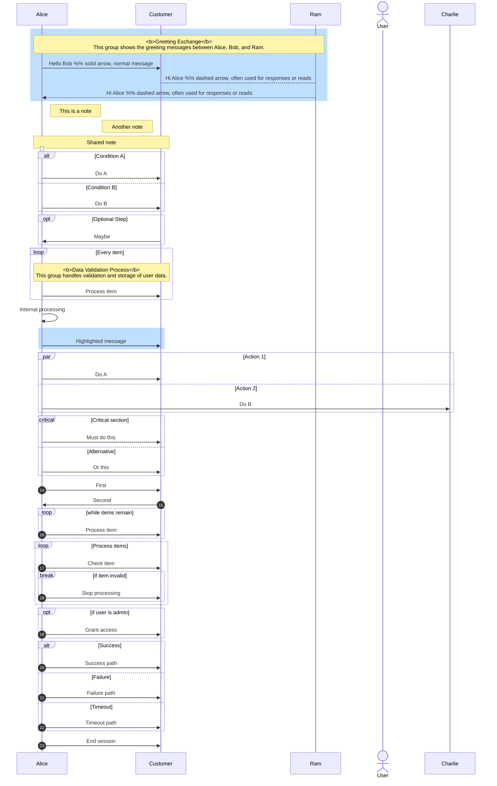

# Multi-Database Business Validation Tool

This tool provides a framework for connecting to multiple databases (PostgreSQL, Oracle, Teradata, and Snowflake) and performing business validations across them. The tool is designed with security in mind, using environment variables for sensitive credentials.

## Prerequisites

- Python 3.8 or higher
- Access to the following databases:
  - PostgreSQL
  - Oracle
  - Teradata
  - Snowflake
- Required database clients/drivers installed:
  - Oracle Instant Client (for cx_Oracle)
  - PostgreSQL client libraries
  - Teradata drivers
  - Snowflake connector dependencies

## Setup

1. Clone the repository and create a virtual environment:
```bash
git clone <repository-url>
cd python-dbs-poc
python -m venv venv
source venv/bin/activate  # On Windows: venv\Scripts\activate
```

2. Install the required packages:
```bash
pip install -r requirements.txt
```

3. Create a `.env` file in the root directory with your database credentials:
```ini
# PostgreSQL Configuration
PG_HOST=localhost
PG_DATABASE=your_database_name
PG_USER=your_username
PG_PASSWORD=your_password
PG_PORT=5432

# Oracle Configuration
ORACLE_HOST=oracle.example.com
ORACLE_SERVICE=your_service_name
ORACLE_USER=your_username
ORACLE_PASSWORD=your_password
ORACLE_PORT=1521

# Teradata Configuration
TERADATA_HOST=teradata.example.com
TERADATA_USER=your_username
TERADATA_PASSWORD=your_password
TERADATA_DATABASE=your_database

# Snowflake Configuration
SNOWFLAKE_ACCOUNT=your_account_locator  # e.g., xy12345.us-east-1
SNOWFLAKE_USER=your_username
SNOWFLAKE_PASSWORD=your_password
SNOWFLAKE_DATABASE=your_database
SNOWFLAKE_WAREHOUSE=your_warehouse  # e.g., COMPUTE_WH
SNOWFLAKE_SCHEMA=your_schema  # e.g., PUBLIC
```

## Database-Specific Setup Notes

### Oracle
- Install Oracle Instant Client matching your Oracle database version
- Set `LD_LIBRARY_PATH` (Linux) or `PATH` (Windows) to include Oracle Instant Client
- Service name is required (not SID)

### PostgreSQL
- Install `postgresql-devel` (Linux) or PostgreSQL (Windows)
- Default port is 5432
- Database name is required

### Teradata
- Install Teradata ODBC drivers
- Use fully qualified hostname
- Database name is your default database

### Snowflake
- No additional client installation required
- Account locator format: `xy12345.us-east-1`
- Warehouse name is required (e.g., `COMPUTE_WH`)

## Available Validations

The tool currently includes three sample business validations:

1. Customer Data Validation (`validate_customer_data`)
   - Compares customer counts across all databases for the last month
   - Ensures data consistency across systems
   - Returns detailed count comparison

2. Revenue Data Validation (`validate_revenue_data`)
   - Compares daily revenue between PostgreSQL and Snowflake
   - Identifies discrepancies larger than 1%
   - Returns detailed discrepancy report

3. Inventory Level Validation (`validate_inventory_levels`)
   - Compares inventory levels between PostgreSQL and Oracle
   - Identifies products with mismatched stock levels
   - Returns detailed product-level discrepancies

## Running Validations

Execute the validation script:
```bash
python src/business_validations.py
```

Sample output:
```
Validating customer data...
Status: PASSED
Message: Customer counts match across all systems

Validating revenue data...
Status: FAILED
Message: Found 2 days with revenue discrepancy > 1%

Validating inventory levels...
Status: PASSED
Message: Inventory levels match across systems
```

## Security Best Practices

1. Environment Variables
   - Never commit `.env` file to version control
   - Restrict `.env` file permissions (`chmod 600 .env` on Unix)
   - Use different credentials for different environments

2. Database Access
   - Use read-only database users for validations
   - Create dedicated validation users with minimal privileges
   - Regularly rotate database credentials
   - Consider using a secrets management service in production

3. Network Security
   - Use SSL/TLS connections where available
   - Consider using SSH tunnels for remote databases
   - Implement proper firewall rules

## Customizing Validations

To add new business validations:

1. Add new methods to the `BusinessValidator` class in `src/business_validations.py`
2. Follow the existing pattern:
   ```python
   def validate_new_data(self) -> Dict[str, Any]:
       try:
           # Your validation logic here
           return {
               'validation_status': 'PASSED/FAILED',
               'message': 'Validation result message'
           }
       except Exception as e:
           return {
               'validation_status': 'ERROR',
               'message': f'Error during validation: {str(e)}'
           }
   ```
3. Add appropriate error handling
4. Return structured validation results

## Error Handling

The tool implements comprehensive error handling:
- Connection errors are caught and reported
- Query execution errors are handled gracefully
- Resources are properly closed using context managers
- Each validation method includes try-catch blocks
- Detailed error messages are provided

## Contributing

1. Fork the repository
2. Create a feature branch
3. Add tests for new features
4. Submit a pull request

## Troubleshooting

Common issues and solutions:

1. Database Connection Issues
   - Verify credentials in `.env` file
   - Check network connectivity
   - Ensure database client libraries are installed
   - Verify port accessibility

2. Query Execution Errors
   - Check table permissions
   - Verify SQL syntax for specific database
   - Ensure required tables exist

3. Environment Setup
   - Verify Python version compatibility
   - Check virtual environment activation
   - Confirm all dependencies are installed

## License

MIT License 


