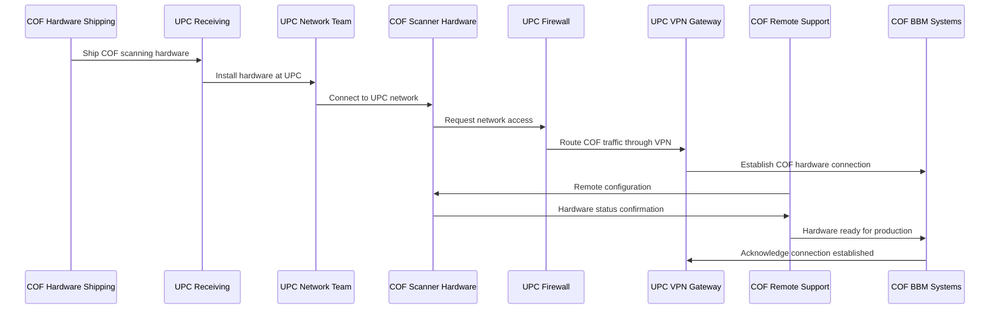
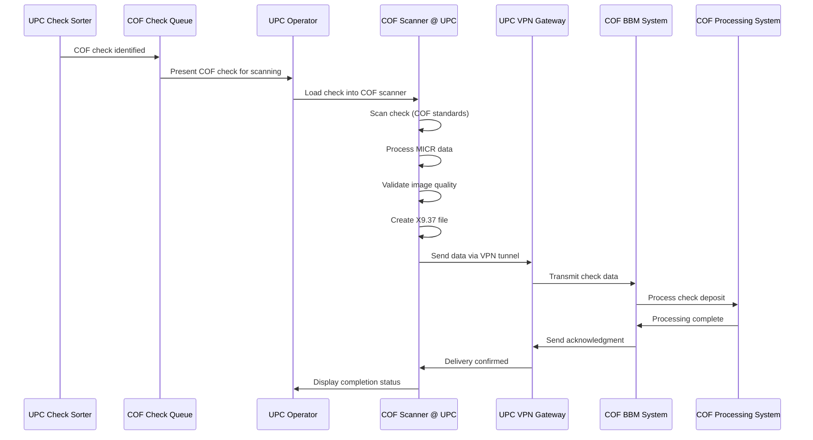
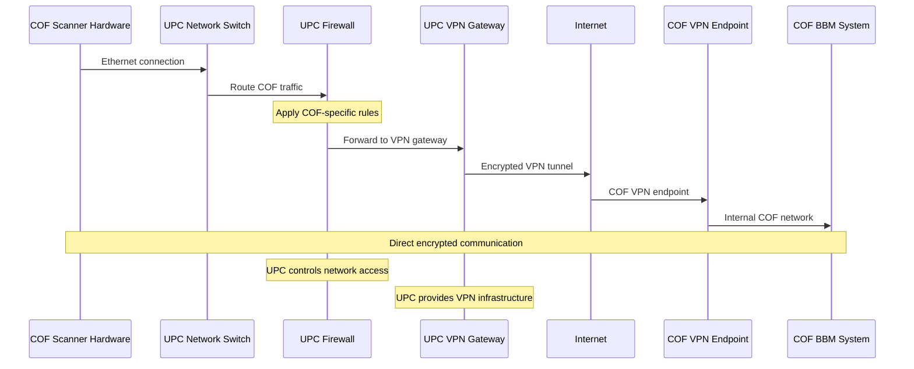

Excellent! This makes much more sense. Capital One will provide their own scanning hardware at UPC that connects through your VPN infrastructure. This gives COF control over their scanning standards while leveraging UPC's VPN connectivity.

## Architecture Overview

```
Mail/PO Box → UPC → Check Sorting:
                    ├── Your Bank Checks → Branch → Fiserv SCO → Internal Processing
                    └── COF Checks → COF Hardware @ UPC → UPC VPN → Capital One BBM
```

## Sequence Diagrams

### **1. COF Hardware Setup and Integration at UPC**



### **2. COF Check Processing with COF Hardware at UPC**



### **3. Network Integration and Traffic Flow**



## UPC Infrastructure Configuration

### **1. COF Hardware Network Integration**

```yaml
# UPC Network Configuration for COF Hardware
cof_hardware_config:
  network_segment:
    vlan_id: 150
    subnet: "192.168.150.0/24"
    gateway: "192.168.150.1"
    dns_servers: ["8.8.8.8", "8.8.4.4"]
    
  hardware_specifications:
    scanner_model: "COF_ScanMaster_Pro_2024"
    ip_address: "192.168.150.10"
    subnet_mask: "255.255.255.0"
    mac_address: "To be provided by COF"
    
  firewall_rules:
    allow_outbound:
      - destination: "COF_BBM_NETWORK"
        ports: [443, 22, 161]
        protocol: "TCP"
      - destination: "COF_SUPPORT_NETWORK" 
        ports: [443, 22]
        protocol: "TCP"
    deny_inbound:
      - source: "ANY"
        destination: "COF_HARDWARE"
        action: "DENY"
    allow_management:
      - source: "UPC_ADMIN_NETWORK"
        destination: "COF_HARDWARE"
        ports: [22, 80, 443]
        protocol: "TCP"
        
  vpn_routing:
    dedicated_tunnel: "UPC-COF-Hardware"
    local_subnet: "192.168.150.0/24"
    remote_subnet: "10.60.40.0/24"
    bandwidth_allocation: "100Mbps"
    qos_priority: "HIGH"
```

### **2. UPC Operational Procedures**

```python
# UPC COF Hardware Operations
class UPCCOFHardwareManager:
    def __init__(self):
        self.cof_hardware_ip = "192.168.150.10"
        self.vpn_gateway = UPCVPNGateway()
        self.cof_queue = COFCheckQueue()
        
    def process_cof_checks_with_cof_hardware(self):
        """Process COF checks using COF's hardware at UPC"""
        
        # Get COF checks from sorting
        cof_checks = self.cof_queue.get_pending_checks()
        
        if not cof_checks:
            return {"status": "no_checks", "processed": 0}
        
        processed_count = 0
        errors = []
        
        for check in cof_checks:
            try:
                # Direct operator to COF hardware
                result = self.process_check_with_cof_hardware(check)
                
                if result.success:
                    processed_count += 1
                    self.log_successful_processing(check, result)
                else:
                    errors.append(f"Check {check.id}: {result.error}")
                    
            except Exception as e:
                errors.append(f"Check {check.id}: {str(e)}")
                self.handle_processing_error(check, e)
        
        return {
            "status": "completed",
            "processed": processed_count,
            "errors": errors,
            "hardware_status": self.check_cof_hardware_status()
        }
    
    def process_check_with_cof_hardware(self, check):
        """Process single check using COF hardware"""
        
        # Operator presents check to COF scanner
        scan_request = {
            'upc_check_id': check.upc_id,
            'check_source': 'UPC_MAIL_PROCESSING',
            'operator_id': self.get_current_operator_id(),
            'timestamp': datetime.now().isoformat()
        }
        
        # COF hardware handles all scanning and transmission
        # UPC just monitors the process
        result = self.monitor_cof_hardware_processing(scan_request)
        
        return result
    
    def monitor_cof_hardware_processing(self, scan_request):
        """Monitor COF hardware processing status"""
        
        try:
            # Check COF hardware status
            hardware_status = self.ping_cof_hardware()
            if not hardware_status.online:
                raise COFHardwareError("COF scanner offline")
            
            # Check VPN connectivity to COF
            vpn_status = self.vpn_gateway.check_cof_tunnel_status()
            if not vpn_status.connected:
                raise VPNConnectivityError("COF VPN tunnel down")
            
            # COF hardware processes automatically
            # We just wait for completion signal
            processing_result = self.wait_for_cof_processing_completion(scan_request)
            
            return processing_result
            
        except Exception as e:
            return ProcessingResult(success=False, error=str(e))
    
    def check_cof_hardware_status(self):
        """Check status of COF hardware at UPC"""
        
        try:
            # Ping COF hardware
            hardware_ping = subprocess.run(
                ['ping', '-c', '1', self.cof_hardware_ip],
                capture_output=True,
                timeout=5
            )
            
            hardware_online = hardware_ping.returncode == 0
            
            # Check VPN tunnel to COF
            vpn_status = self.vpn_gateway.check_cof_tunnel_status()
            
            # Get hardware operational status (if accessible)
            hardware_health = self.get_cof_hardware_health()
            
            return {
                'hardware_online': hardware_online,
                'vpn_connected': vpn_status.connected,
                'hardware_health': hardware_health,
                'last_check_time': datetime.now().isoformat()
            }
            
        except Exception as e:
            return {
                'hardware_online': False,
                'vpn_connected': False,
                'error': str(e),
                'last_check_time': datetime.now().isoformat()
            }
```

### **3. VPN Configuration for COF Hardware Traffic**

```bash
#!/bin/bash
# UPC VPN Configuration for COF Hardware

# Create dedicated VPN tunnel for COF hardware
configure_cof_hardware_vpn() {
    local COF_HARDWARE_SUBNET="192.168.150.0/24"
    local COF_BBM_NETWORK="10.60.40.0/24"
    local VPN_GATEWAY="203.0.113.10"
    
    # Configure IPSec tunnel for COF hardware
    ipsec_config="
    conn UPC-COF-Hardware
        type=tunnel
        authby=secret
        left=$VPN_GATEWAY
        leftsubnet=$COF_HARDWARE_SUBNET
        right=cof-vpn.capitalone.com
        rightsubnet=$COF_BBM_NETWORK
        ike=aes256-sha256-modp2048
        esp=aes256-sha256
        keyexchange=ikev2
        auto=start
        dpdaction=restart
        dpddelay=30
        dpdtimeout=120
    "
    
    # Apply configuration
    echo "$ipsec_config" >> /etc/ipsec.conf
    
    # Configure firewall rules for COF hardware
    configure_cof_firewall_rules
    
    # Start VPN tunnel
    ipsec restart
    ipsec up UPC-COF-Hardware
}

configure_cof_firewall_rules() {
    # Allow COF hardware to communicate with COF BBM
    iptables -A FORWARD -s 192.168.150.10 -d 10.60.40.0/24 -j ACCEPT
    iptables -A FORWARD -s 10.60.40.0/24 -d 192.168.150.10 -j ACCEPT
    
    # Allow UPC admin access to COF hardware
    iptables -A FORWARD -s 192.168.100.0/24 -d 192.168.150.10 -p tcp --dport 22 -j ACCEPT
    iptables -A FORWARD -s 192.168.100.0/24 -d 192.168.150.10 -p tcp --dport 80 -j ACCEPT
    iptables -A FORWARD -s 192.168.100.0/24 -d 192.168.150.10 -p tcp --dport 443 -j ACCEPT
    
    # Block all other access to COF hardware
    iptables -A FORWARD -d 192.168.150.10 -j DROP
    
    # Save firewall rules
    iptables-save > /etc/iptables/rules.v4
}
```

### **4. UPC Operations Dashboard for COF Hardware**

```python
# UPC Dashboard with COF Hardware Monitoring
class UPCCOFHardwareDashboard:
    def __init__(self):
        self.cof_manager = UPCCOFHardwareManager()
        self.vpn_monitor = VPNTunnelMonitor()
        
    def get_cof_hardware_status(self):
        """Get real-time COF hardware status"""
        
        return {
            'hardware_status': self.cof_manager.check_cof_hardware_status(),
            'vpn_tunnel_status': self.vpn_monitor.get_cof_tunnel_status(),
            'daily_processing': {
                'checks_processed': self.get_daily_cof_count(),
                'success_rate': self.calculate_cof_success_rate(),
                'average_processing_time': self.get_avg_processing_time(),
                'last_processed_check': self.get_last_processed_time()
            },
            'alerts': self.get_cof_hardware_alerts()
        }
    
    def get_daily_operations_summary(self):
        """Daily summary including COF hardware operations"""
        
        today = datetime.now().date()
        
        return {
            'date': today,
            'your_bank_processing': {
                'checks_to_branches': self.get_branch_assignment_count(today),
                'sco_processed': self.get_sco_processing_count(today)
            },
            'cof_hardware_processing': {
                'checks_received': self.get_cof_checks_received(today),
                'checks_processed': self.get_cof_checks_processed(today),
                'processing_success_rate': self.calculate_daily_success_rate(today),
                'hardware_uptime': self.calculate_hardware_uptime(today),
                'vpn_uptime': self.calculate_vpn_uptime(today),
                'total_amount_processed': self.get_cof_total_amount(today)
            },
            'issues': {
                'hardware_downtime': self.get_hardware_downtime_events(today),
                'vpn_disconnections': self.get_vpn_disconnection_events(today),
                'processing_errors': self.get_processing_errors(today)
            }
        }
```

### **5. Benefits of COF Hardware at UPC**

```
Operational Benefits:
├── COF Control
│   ├── COF manages scanning standards and quality
│   ├── COF handles hardware maintenance and updates
│   └── COF provides remote support and monitoring
├── UPC Simplicity
│   ├── No need to purchase/maintain scanning equipment
│   ├── No software licensing for check scanning
│   └── Minimal training required for operators
├── Optimal Processing
│   ├── Direct transmission from COF hardware to COF systems
│   ├── No file format conversion required
│   └── Real-time processing capability
└── Shared Infrastructure
    ├── UPC provides VPN connectivity
    ├── UPC provides physical space and power
    └── UPC provides network integration
```

This approach leverages the best of both organizations: COF's expertise in check scanning technology and UPC's robust VPN infrastructure for secure connectivity.


## What is X9.37 File Format?

X9.37 (also known as X9.37 DSTU - Data Standards Technical Unit) is a standardized file format used in the banking industry for **electronic check image exchange**. It was developed by the American National Standards Institute (ANSI) to facilitate the electronic transmission of check images and associated data between financial institutions.

## Purpose and Background

### **Why X9.37 Exists:**
- **Check 21 Act (2004)**: Enabled electronic processing of paper checks
- **Standardization**: Provides uniform format for check image exchange
- **Efficiency**: Eliminates physical check transportation
- **Interoperability**: Allows different banks to exchange check data seamlessly

## X9.37 File Structure

### **File Organization:**
```
X9.37 File
├── File Header (Type 01)
├── Cash Letter Header (Type 10)
├── Bundle Header (Type 20)
├── Check Detail Records (Type 25)
├── Image View Detail (Type 50 - Front Image)
├── Image View Detail (Type 52 - Back Image)
├── Bundle Control (Type 70)
├── Cash Letter Control (Type 90)
└── File Control (Type 99)
```

## Record Types Explained

### **1. File Header Record (Type 01)**
```
Field Description:
- Record Type: 01
- Standard Level: 03
- Test File Indicator: T/P (Test/Production)
- Immediate Destination Routing: 9-digit routing number
- Immediate Origin Routing: 9-digit routing number
- File Creation Date: YYYYMMDD
- File Creation Time: HHMM
- Resend Indicator: N/Y
```

**Example:**
```
01,03,P,031176110,123456789,20231215,1430,N
```

### **2. Cash Letter Header Record (Type 10)**
```
Field Description:
- Record Type: 10
- Collection Type Indicator: 01 (Forward Collection)
- Destination Routing Number: 9-digit routing
- ECE Institution Routing: 9-digit routing
- Cash Letter Business Date: YYYYMMDD
- Cash Letter Creation Date: YYYYMMDD
- Cash Letter Creation Time: HHMM
```

**Example:**
```
10,01,031176110,123456789,20231215,20231215,1430
```

### **3. Bundle Header Record (Type 20)**
```
Field Description:
- Record Type: 20
- Collection Type Indicator: 01
- Destination Routing Number: 9-digit routing
- ECE Institution Routing: 9-digit routing
- Bundle Business Date: YYYYMMDD
- Bundle Creation Date: YYYYMMDD
- Bundle ID: Unique identifier
```

**Example:**
```
20,01,031176110,123456789,20231215,20231215,BUNDLE001
```

### **4. Check Detail Record (Type 25)**
```
Field Description:
- Record Type: 25
- Auxiliary On-Us: Additional account info
- External Processing Code: Processing flags
- Payor Bank Routing Number: 9-digit routing
- Payor Bank Routing Check Digit: Check digit
- On-Us Field: Account number and check number
- Item Amount: Check amount (implied decimal)
- ECE Sequence Number: Unique sequence
- Documentation Type: G (Image)
- Return Acceptance Indicator: 1 (Accepted)
- MI Recording Indicator: 1 (MICR recorded)
```

**Example:**
```
25,,0,031176110,4,1234567890123456,0000005000,000001,G,1,1
```

### **5. Image View Detail Records (Type 50/52)**
```
Type 50 - Front Image:
- Record Type: 50
- Image Indicator: 1 (Front)
- Image Creator Routing: 9-digit routing
- Image Creator Date: YYYYMMDD
- Image View Format: 00 (TIFF)
- Image View Compression: 00 (Group 4)
- Image View Data Size: Size in bytes
- Image View Data: Actual image data (Base64 encoded)

Type 52 - Back Image:
- Record Type: 52
- Image Indicator: 0 (Back)
- [Same fields as Type 50]
```

## Complete X9.37 File Example

### **Sample File Content:**
```
01,03,P,031176110,123456789,20231215,1430,N
10,01,031176110,123456789,20231215,20231215,1430
20,01,031176110,123456789,20231215,20231215,BUNDLE001
25,,0,031176110,4,1234567890123456,0000005000,000001,G,1,1
50,1,123456789,20231215,00,00,15234,/9j/4AAQSkZJRgABAQEA[...base64 image data...]
52,0,123456789,20231215,00,00,12456,/9j/4AAQSkZJRgABAQEA[...base64 image data...]
25,,0,031176110,4,1234567890789012,0000007500,000002,G,1,1
50,1,123456789,20231215,00,00,14892,/9j/4AAQSkZJRgABAQEA[...base64 image data...]
52,0,123456789,20231215,00,00,13245,/9j/4AAQSkZJRgABAQEA[...base64 image data...]
70,2,2,000000012500,000000012500,0,0,0,0,0
90,1,2,000000012500,000000012500,0,0,0,0,0,0,0
99,1,1,2,000000012500,000000012500,0,0,0,0,0,0,0,0,0,0,0,0,0,0,0,0,0,0,0,0,0,0,0,0,0,0,0
```

## X9.37 File Creation Process

### **Step-by-Step Creation:**

```python
# Example X9.37 File Creation
class X937FileBuilder:
    def __init__(self):
        self.records = []
        self.check_count = 0
        self.total_amount = 0
    
    def create_file_header(self, dest_routing, origin_routing):
        """Create file header record (Type 01)"""
        header = {
            'record_type': '01',
            'standard_level': '03', 
            'test_indicator': 'P',
            'dest_routing': dest_routing,
            'origin_routing': origin_routing,
            'creation_date': datetime.now().strftime('%Y%m%d'),
            'creation_time': datetime.now().strftime('%H%M'),
            'resend_indicator': 'N'
        }
        
        record = ','.join([
            header['record_type'],
            header['standard_level'],
            header['test_indicator'],
            header['dest_routing'],
            header['origin_routing'],
            header['creation_date'],
            header['creation_time'],
            header['resend_indicator']
        ])
        
        self.records.append(record)
        return record
    
    def add_check_detail(self, check_data):
        """Add check detail record (Type 25)"""
        detail = {
            'record_type': '25',
            'aux_on_us': '',
            'ext_processing_code': '0',
            'payor_routing': check_data['routing_number'],
            'routing_check_digit': check_data['routing_check_digit'],
            'on_us': check_data['account_number'] + check_data['check_number'],
            'amount': f"{int(check_data['amount'] * 100):010d}",
            'sequence_number': f"{self.check_count + 1:06d}",
            'doc_type': 'G',
            'return_indicator': '1',
            'mi_indicator': '1'
        }
        
        record = ','.join([
            detail['record_type'],
            detail['aux_on_us'],
            detail['ext_processing_code'],
            detail['payor_routing'],
            detail['routing_check_digit'],
            detail['on_us'],
            detail['amount'],
            detail['sequence_number'],
            detail['doc_type'],
            detail['return_indicator'],
            detail['mi_indicator']
        ])
        
        self.records.append(record)
        self.check_count += 1
        self.total_amount += check_data['amount']
        return record
    
    def add_image_view(self, image_data, side='front'):
        """Add image view record (Type 50/52)"""
        image_record = {
            'record_type': '50' if side == 'front' else '52',
            'image_indicator': '1' if side == 'front' else '0',
            'creator_routing': '123456789',
            'creator_date': datetime.now().strftime('%Y%m%d'),
            'format_indicator': '00',  # TIFF
            'compression': '00',       # Group 4
            'data_size': str(len(image_data)),
            'image_data': base64.b64encode(image_data).decode('ascii')
        }
        
        record = ','.join([
            image_record['record_type'],
            image_record['image_indicator'],
            image_record['creator_routing'],
            image_record['creator_date'],
            image_record['format_indicator'],
            image_record['compression'],
            image_record['data_size'],
            image_record['image_data']
        ])
        
        self.records.append(record)
        return record
```

## X9.37 in Your UPC-COF Workflow

### **How COF Hardware Creates X9.37:**

```python
# COF Hardware X9.37 Creation Process
class COFHardwareX937Creator:
    def process_check_for_x937(self, physical_check):
        """Process check and create X9.37 file"""
        
        # 1. Scan check images
        front_image = self.scan_front_image(physical_check)
        back_image = self.scan_back_image(physical_check)
        
        # 2. Read MICR data
        micr_data = self.read_micr_line(physical_check)
        
        # 3. Create X9.37 file
        x937_builder = X937FileBuilder()
        
        # File header
        x937_builder.create_file_header(
            dest_routing='031176110',    # Capital One
            origin_routing='123456789'   # Your bank
        )
        
        # Cash letter header
        x937_builder.create_cash_letter_header()
        
        # Bundle header  
        x937_builder.create_bundle_header()
        
        # Check detail
        x937_builder.add_check_detail({
            'routing_number': micr_data.routing_number,
            'routing_check_digit': micr_data.check_digit,
            'account_number': micr_data.account_number,
            'check_number': micr_data.check_number,
            'amount': self.extract_amount(physical_check)
        })
        
        # Add images
        x937_builder.add_image_view(front_image, 'front')
        x937_builder.add_image_view(back_image, 'back')
        
        # Control records
        x937_builder.add_bundle_control()
        x937_builder.add_cash_letter_control()
        x937_builder.add_file_control()
        
        # Generate final file
        x937_file = x937_builder.build()
        
        return x937_file
```

## Key Benefits of X9.37 Format

### **1. Standardization:**
- Universal format across banking industry
- Consistent data structure and field definitions
- Interoperability between different systems

### **2. Completeness:**
- Contains both MICR data and check images
- Includes all necessary processing information
- Maintains audit trail and control totals

### **3. Security:**
- Structured format with validation capabilities
- Control records ensure file integrity
- Supports encryption and digital signatures

### **4. Efficiency:**
- Electronic transmission replaces physical transport
- Automated processing capabilities
- Reduced processing time and costs

The X9.37 format is essential for modern check processing, enabling the electronic exchange of check images and data while maintaining the security and integrity required for financial transactions.
